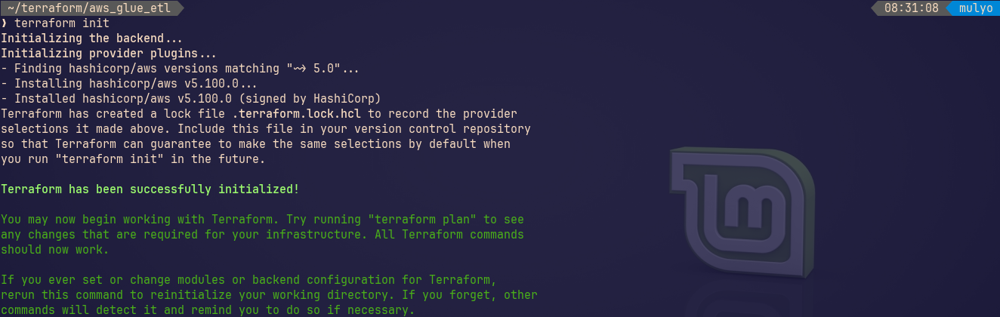

# Terraform_AWS_Glue_ELT_Pipeline
ELT Pipeline using AWS Glue with Terraform infrastructure configuration

# *Overview*
Project repo to demonstrate using Terraform to manage resource AWS S3 infrasture and utilize AWS Glue fot ELT Pipeline. Terraform is powerful tool to define, provision, manage cloud infrasture using code (Infrastucture as Code) with simple way. This project will create 3 S3 bucket: bucket-input -- data source, bucket-ouput -- result ETL, bucket-scripts -- ETL code placing. ETL procress itself done in AWS Glue run. 
# *Prerequisites*
To follow along this project need to be availabled on system:
- AWS account
 <!-- newline -->
  &nbsp;&nbsp;&nbsp;&nbsp;Go to [aws.amazon.com](https://aws.amazon.com/) and create account
- Terraform installed
  ```bash
  wget -O - https://apt.releases.hashicorp.com/gpg | sudo gpg --dearmor -o /usr/share/keyrings/hashicorp-archive-keyring.gpg
  echo "deb [arch=$(dpkg --print-architecture) signed-by=/usr/share/keyrings/hashicorp-archive-keyring.gpg] https://apt.releases.hashicorp.com $(grep -oP '(?  <=UBUNTU_CODENAME=).*' /etc/os-release || lsb_release -cs) main" | sudo tee /etc/apt/sources.list.d/hashicorp.list
  sudo apt update && sudo apt install terraform
  ```
- AWS cli installed
  ```bash
  curl "https://awscli.amazonaws.com/awscli-exe-linux-x86_64.zip" -o "awscliv2.zip"
  unzip awscliv2.zip
  sudo ./aws/install
  ```
- Vim installed (optional)
  ```bash
  sudo apt install vim
  vimm --version
  ```
# *Project Flow*
1. Create a Working Directory
   ```bash
   mkdir aws_glue_etl
   cd aws_glue_etl
   ```
3. Initialize Terraform
   ```bash
   # create file provider
   vim provider.tf

   # run
   terraform init
   ```
   
5. Define Variables (Optional but Good Practice)
   ```bash
   # create file variables.tf
   vim variables.tf
   ```
7. Create the ETL Script
   ```bash
   # create file elt_script.py
   vim etl_script.py
   ```
9. Define Resources in Terraform
    ```bash
    # create file main.tf
    vim main.tf
    ```
11. Plan and Apply
    ```bash
    # run
    terraform plan

    terraform apply
    ```
    AWS S3 Bucket result:
    
13. Run the ETL Pipeline
    ```bash
    # Upload sample data to input bucket
    aws s3 cp sales_record.csv s3://aws-etl-app-input/
    ```
    
    Run the Glue job:
    * In AWS Glue Console > Jobs > Select your job > Actions > Run job.
    * Wait 2-5 minutes (Glue spins up Spark under the hood).
      
    Check output:
    * In S3 > aws-etl-app-output > transformed_data/ > Download Parquet files (use tools like Parquet viewer or Pandas to inspect).
      
15. Cleanup (Important!)
    ```bash
    terraform destroy
    ```
